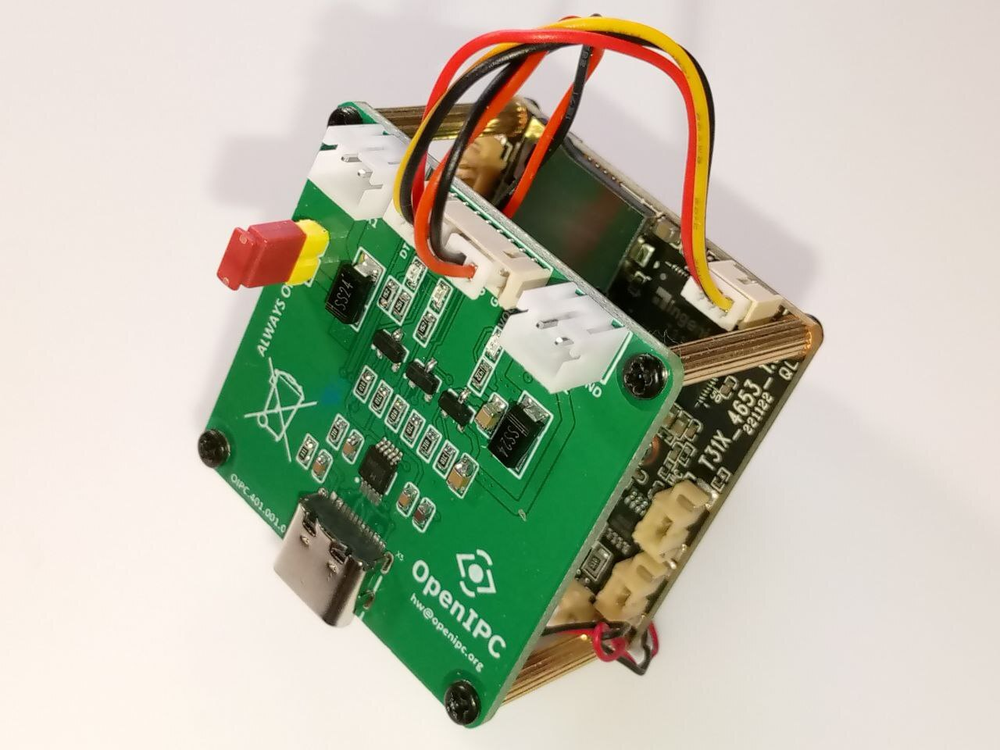

# Vectis

Vectis is intended for fast debugging and device control during development and integration of embedded systems with the OpenIPC UART 38x38 board.
It opens a serial port, bridges keyboard input to UART, prints UART data to the terminal, and can generate a reset pulse on RTS/DTR lines.
It can also expose the same UART bridge over TCP/IP for one remote client at a time.



## Features

- Configurable serial port and baud rate
- Optional TCP listener port
- Raw terminal input/output bridge
- TCP/IP client bridge (legacy raw mode + auto-detected RFC 2217)
- RTS/DTR status display
- Ctrl+P reset pulse on RTS/DTR
- Syslog logging for key events and errors
- **RFC 2217** (Telnet COM Port Control Option, [RFC 2217][rfc2217])
  on the TCP listener — auto-detected per connection, no extra
  CLI flags. Gives standard clients a binary-safe data path and
  out-of-band RTS/DTR/baud-rate control.

[rfc2217]: https://datatracker.ietf.org/doc/html/rfc2217

## Build

```sh
make
```

This builds both `vectis` and `vectis-cli`.

## vectis-cli

`vectis-cli` is an RFC 2217/Telnet terminal client for Linux. It connects to a
TCP server that exposes a serial port (such as `vectis` itself or `ser2net`),
switches the local terminal to raw mode, and provides a full interactive serial
console over the network. It also supports **direct access to local serial
devices** — any `/dev/tty*` path (e.g. `/dev/ttyUSB0`, `/dev/ttyS0`,
`/dev/ttyACM0`) — without going through TCP at all.

### How it works

`vectis-cli` connects to a TCP server, puts the local terminal into raw mode,
and negotiates the following Telnet options with the server: `BINARY`, `SGA`,
and `COM-PORT-OPTION` (RFC 2217). Once negotiation is complete, it configures
the remote serial port by sending `SET_BAUDRATE`, `SET_DATASIZE`,
`SET_STOPSIZE`, `SET_PARITY`, and `SET_CONTROL` sub-options for DTR and RTS.

The incoming byte stream is parsed as Telnet/RFC 2217: plain data bytes are
written to stdout, `IAC` sequences (`0xFF`) are intercepted and processed
separately, and escaped `0xFF 0xFF` pairs are unescaped to a single `0xFF`
before being forwarded to the terminal. Outgoing keyboard input is sent in
binary mode, with any `0xFF` bytes escaped as `IAC IAC` per RFC 854.

**Ctrl+P** sends a reset pulse to the target device: it issues `SET_CONTROL`
commands to drop DTR and RTS for a configurable duration (default 200 ms), then
reasserts them. In direct serial mode the same pulse is applied to the local
port via `ioctl(TIOCMBIC/TIOCMBIS)`.

### Usage

```sh
./vectis-cli -h <host> -p <port> [options]
./vectis-cli -u <device> [options]
```

RFC 2217/Telnet mode:

- `-h HOST` — RFC 2217 server address
- `-p PORT` — TCP port

Direct serial mode:

- `-u DEVICE` — local tty device path, for example `/dev/ttyUSB0`

Port settings (default **115200 8N1**):

- `-b BAUD` — baud rate (default 115200)
- `-d 5|6|7|8` — data bits (default 8)
- `-s 1|2` — stop bits (default 1)
- `-y N|E|O` — parity None/Even/Odd (default N)

Connection options:

- `-r` — reconnect automatically on disconnect (RFC 2217 mode only)
- `-t MS` — reset pulse duration in milliseconds (default 200)
- `-v`, `--version` — print version and release date
- `--help`, `-?` — help

### Examples

```sh
# 115200 8N1 — all parameters at their defaults
./vectis-cli -h 192.168.1.10 -p 7000

# 9600 8E1
./vectis-cli -h 192.168.1.10 -p 7000 -b 9600 -y E

# Auto-reconnect on disconnect
./vectis-cli -h 192.168.1.10 -p 7000 -r

# Direct serial device at 115200
./vectis-cli -u /dev/ttyUSB0

# Direct serial device at 460800 baud, 500 ms reset pulse
./vectis-cli -u /dev/ttyUSB0 -b 460800 -t 500
```

## Usage

```sh
./vectis [options]
```

### Options

- `-p, --port <port>` — serial device path, default: `/dev/ttyUSB0`
- `-b, --baud <rate>` — baud rate, default: `115200`
- `-t, --tcp-port [port]` — enable TCP listener, default port: `35240`
- `-s, --status` — print RTS/DTR status
- `-v, --version` — print version and build date
- `-h, --help` — show help

### Hotkeys

- `Ctrl+P` — generate an inverted reset pulse on RTS and DTR
- `Ctrl+C` — exit
- `Ctrl+X` — exit

## Notes

- UART is configured for `8N1`.
- RTS and DTR are asserted on startup and deasserted on exit.
- RTS and DTR use normal asserted/deasserted signaling.
- The Ctrl+P pulse uses the opposite asserted/deasserted sequence.
- This tool is designed for rapid debugging and control, including power-related device handling, during integration work with OpenIPC UART 38x38.
- The TCP listener accepts one client at a time.
- The TCP listener starts only when `-t` is provided.
- For interactive TCP use, run the local terminal side in raw mode so keys like `Ctrl+P` are sent immediately without waiting for `Enter`.
- Example:

```sh
socat -,raw,echo=0 TCP:192.168.1.10:35240
```

```sh
nc -C 192.168.1.10 35240
```

## RFC 2217 mode (binary-safe + out-of-band control)

The TCP listener auto-detects whether a connecting client speaks
[RFC 2217][rfc2217] (Telnet COM-Port Control Option). Detection is
purely passive: Vectis stays in legacy raw mode until the client
transmits a Telnet `IAC` byte (`0xFF`). Interactive humans never
type `0xFF`, so existing `socat`/`nc`/`cat` workflows are unchanged.
The moment a programmatic client begins option negotiation Vectis
locks into Telnet mode for the rest of that connection and:

- stops intercepting `Ctrl+P` (`0x10`) — the data path is binary-safe;
- stops `\n`→`\r` normalisation and TCP-echo suppression;
- escapes `0xFF` in both directions as `0xFF 0xFF` per RFC 854;
- accepts `SET-CONTROL` to drive RTS/DTR independently
  (values `8`/`9` = DTR ON/OFF, `10`/`11` = RTS ON/OFF);
- accepts `SET-BAUDRATE` (the same fixed list `9600`, `19200`, `38400`,
  `57600`, `115200`, `230400` that `-b` supports);
- replies to `SIGNATURE` with `Vectis <version>`;
- accepts a vendor-extension sub-option `BOOTROM-CATCH` (50) that
  pulses RTS/DTR and runs the HiSilicon bootrom `0x20`-marker /
  `0xAA`-ack handshake locally — see "BOOTROM-CATCH" below.

### BOOTROM-CATCH (vendor extension, sub-option 50)

The HiSilicon boot ROM emits `0x20` markers and listens for `0xAA`
in a ~100 ms window after reset.  Over a network with one-way
latency above ~25 ms a remote client cannot complete a marker→ack
round trip in time, so the camera autoboots before the client sees
the markers.  The `BOOTROM-CATCH` sub-option moves the catch loop
into Vectis itself, next to the UART, where the response time is
in microseconds — RTT and jitter no longer matter.

Wire format (client → server):

```
IAC SB COMPORT BOOTROM-CATCH
    <pulse_ms     : 4 bytes BE>
    <max_wait_ms  : 4 bytes BE>
    [<mode        : 1 byte>]   # optional, default 0 = MARKER
    [<min_markers : 1 byte>]   # optional, MARKER threshold; 0 → default (5)
    [<head_frame  : ≤ 64 bytes>] # optional pipelined HEAD frame
IAC SE
```

- `pulse_ms` (clamped to `0..5000`) — RTS+DTR low time before the
  catch loop starts.  Set to `0` when external hardware (e.g. a
  PoE switch) handles the actual reset.
- `max_wait_ms` (clamped to `100..30000`) — overall catch deadline.
  `5000` is a comfortable default.
- `mode` (optional, default `0`):
  - `0  MARKER` — wait for `min_markers` consecutive `0x20` bytes
    from the chip, then send a final `0xAA`.  Matches the documented
    hi3516 bootrom protocol; finishes early (typically ~500 ms) when
    the chip emits markers.  Returns ``OK`` on confirmation,
    ``TIMEOUT`` if no qualifying run within `max_wait_ms`.
  - `1  BLIND` — keep blasting `0xAA` for the full `max_wait_ms`
    and unconditionally return ``OK``.  Use for chip variants that
    enter download mode silently without emitting markers we can
    observe.  The client confirms by sending a HEAD frame and
    watching for an ACK.
- `min_markers` (optional, MARKER mode only).  How many *consecutive*
  `0x20` bytes the chip must emit before the catch is declared
  successful.  `0` (and the no-byte default) → 5, the canonical
  HiSilicon protocol value.  Some hi3516 variants emit shorter
  bursts and need `4` (or even `3`).  Clamped server-side to `1..16`.
  An adaptive client can issue the catch with `0`, observe the
  reply's `max_marker_run`, and retry with `min_markers =
  max_marker_run` if the first attempt timed out — purely
  protocol-driven, no operator intervention.

- `head_frame` (optional, any bytes appended after byte 10).  The
  *first* HEAD frame the client wants to send to the chip after the
  catch.  When present, Vectis writes the final `0xAA` followed —
  with no network round trip in between — by the HEAD frame and
  captures the chip's reply byte locally.  This is the bit that
  closes the RTT-window problem: on links where the chip's
  download-mode hold window is shorter than one client→server round
  trip, the chip otherwise moves on to SPL before any client-issued
  HEAD can arrive.  Capped server-side to 64 bytes (a HiSilicon
  HEAD frame is 14, with margin for variants).

Older clients that send only the 8/9/10-byte payload default to
MARKER mode, the canonical threshold, and no HEAD pipelining
respectively — no behaviour change.

Wire format (server → client):

```
IAC SB COMPORT (BOOTROM-CATCH+100=150)
    <status        : 1 byte>      0=ok / 1=timeout / 2=io_err
    <markers_seen  : 4 bytes BE>  total 0x20 bytes counted
    <max_marker_run: 1 byte>      longest consecutive 0x20 run (capped 255)
    <bytes_rx      : 4 bytes BE>  total bytes received from UART
    <bytes_tx      : 4 bytes BE>  total 0xAA bytes blasted
    <elapsed_ms    : 4 bytes BE>  actual catch-loop runtime
    <last_byte     : 1 byte>      last non-marker byte (0 if none)
    <head_ack      : 1 byte>      chip's reply to the pipelined HEAD,
                                  or 0 if no HEAD was provided
    <head_ack_seen : 1 byte>      1 if any byte arrived during the
                                  post-HEAD window (so a `head_ack=0`
                                  can be told from "no reply at all")
IAC SE
```

The trailing counters are diagnostic: a high-RTT or noisy-link
client can see whether the catch failed because the chip really
emitted nothing (`bytes_rx=0`), because a different byte family
arrived (`last_byte` non-zero, `markers_seen=0`), or because some
markers arrived but never strung together (`markers_seen` high but
`max_marker_run < 5`).  Older clients that read just the first
byte (status) still work — the extra counters are appended after
it.

While the catch loop runs, Vectis owns the local UART exclusively
(no bytes forwarded to the client).  After it returns, normal
forwarding resumes — the client can immediately send a `HEAD` frame
and proceed with the firmware upload.

Example client (Python, with `pyserial`):

```python
import serial, struct, socket
ser = serial.serial_for_url("rfc2217://vectis.lan:35240", baudrate=115200)
sock = ser._socket
# Ask Vectis to do a 200 ms RTS/DTR pulse, then catch the bootrom
# locally with a 5-second deadline.  Mode 0 = MARKER (default), 1 = BLIND.
sock.sendall(
    b"\xff\xfa\x2c\x32"
    + struct.pack(">IIB", 200, 5000, 0)
    + b"\xff\xf0",
)
# (Read the IAC SB 44 150 <status> IAC SE reply with your IAC parser.)
ser.write(head_frame)            # bootrom is now in download mode
print(ser.read(1))                # → b"\xaa"
```

RFC 2217 detection runs on **both** TCP entry points:

- the standalone `-t [port]` listener, and
- the inetd `nowait` socket (where stdin/stdout *is* the TCP socket).

The legacy `Ctrl+P` hotkey on the local interactive console (no `-t`,
stdin is a tty) is unchanged — humans don't speak Telnet by hand, so
the detection is a no-op for them.

### User stories

#### A. Existing interactive user — *no change*

```sh
socat -,raw,echo=0 TCP:192.168.1.10:35240
# press Ctrl+P → camera resets, exactly like before
```

`socat` never sends `0xFF`, so Vectis stays in legacy mode.

#### B. Telnet client — *binary safe + DTR/RTS control over an out-of-band channel*

```sh
telnet 192.168.1.10 35240
```

`telnet` opens with `IAC DO SUPPRESS-GO-AHEAD` etc., so Vectis flips
into RFC 2217 mode. From the `telnet>` escape prompt you can issue
`send brk`, `set binary`, etc. The data path is now 8-bit clean.

#### C. Programmatic client — `pyserial`'s `rfc2217://` transport

```python
import serial, time
ser = serial.serial_for_url("rfc2217://192.168.1.10:35240")
ser.baudrate = 115200          # SET-BAUDRATE under the hood
ser.dtr = False; ser.rts = False
time.sleep(0.2)                # 200 ms reset pulse
ser.dtr = True;  ser.rts = True
ser.write(open("u-boot.bin", "rb").read())   # binary safe
print(ser.read(256))
```

`pyserial` performs the IAC handshake transparently, escapes any
`0xFF` byte in the firmware as `0xFF 0xFF` on the wire, and turns
`ser.dtr = False` into a `SET-CONTROL` command. This is exactly the
shape any "flash a firmware blob through the camera's UART" tool
needs, and it works against the **same TCP listener** that
interactive humans use — no second port, no flags.

#### D. ser2net interop

```sh
ser2net -t '192.168.1.10,35240,RFC2217'
```

`ser2net` natively groks Vectis's RFC 2217 server, so Vectis can be
slotted into existing serial-server fleets without new conventions.

For a YAML-based `ser2net` setup, this pattern works well:

```yaml
%YAML 1.1
---
# one, please submit it as a bugreport

define: &banner \r\nser2net port \p device \d [\B] (Debian GNU/Linux)\r\n\r\n

connection: &usb0
    accepter: telnet(rfc2217),tcp,4440
    enable: on
    options:
      banner: *banner
      kickolduser: true
      telnet-brk-on-sync: true
    connector: serialdev,/dev/ttyUSB0,115200n81,local

connection: &usb1
    accepter: telnet(rfc2217),tcp,4441
    enable: on
    options:
      banner: *banner
      kickolduser: true
      telnet-brk-on-sync: true
    connector: serialdev,/dev/ttyUSB1,115200n81,local
```

This exposes `/dev/ttyUSB0` on port `4440` and `/dev/ttyUSB1` on port
`4441` with RFC 2217 enabled.

## The inetd integration

Vectis can also be launched from `inetd`:

```conf
# OpenIPC
#
35240   stream  tcp     nowait  root    /usr/local/sbin/vectis vectis -s -p /dev/ttyUSB0 -b 115200
```

In `nowait` mode each TCP connection spawns a fresh Vectis with the
socket wired to its stdin/stdout. RFC 2217 detection works on this
path too: a programmatic client sending `IAC` flips the connection
into Telnet mode, sub-options like `SET-CONTROL` are answered over
the same socket, and `0xFF` bytes are escaped per RFC 854.

On Debian/Ubuntu, install `inetd` with:

```sh
sudo apt update
sudo apt install inetutils-inetd
```

## The inittab integration

Vectis can also be started from `inittab` on systems with BusyBox init:

```conf
# OpenIPC
#
ttyS0::respawn:/usr/local/sbin/vectis -s -p /dev/ttyUSB0 -b 115200
```
