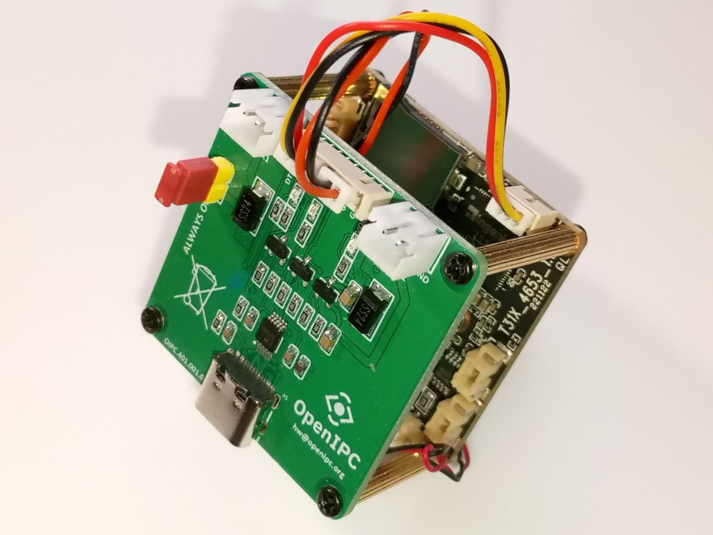

# Vectis

Vectis is a serial console for fast debugging and device control during
development and integration of embedded systems with the OpenIPC UART
38x38 board. One small binary, `vectis`, plays three roles at once:

- **console** — bridges the keyboard to a serial port, either a local
  device (`-u /dev/ttyUSB0`) or one exposed by an RFC 2217 server
  (`-h HOST -p PORT`), with a reset pulse on RTS/DTR on `Ctrl+P` and a
  break on `Ctrl+B`;
- **server** — `-l PORT` serves the local port over TCP to telnet,
  another `vectis`, pyserial or nc, with Telnet/RFC 2217 negotiation,
  binary-safe data and out-of-band control of baud rate, line settings
  and RTS/DTR;
- **web** — `-w PORT` serves a power-control page (Enable / Disable /
  Reset on RTS+DTR) and a small JSON API for scripts.

It runs interactively in a terminal or as a daemon (`systemd`, no
terminal), reopens the device link on its own when an adapter is
unplugged, and needs nothing but libc.



`vectis-bootrom.c`, the original UART bridge this program grew out of, is
kept in the repository for its HiSilicon boot-ROM catching extension; it
is described at the end of this document and is not part of the default
build.

## Features

- Local serial devices (`/dev/ttyUSB*`, `/dev/ttyS*`, `/dev/ttyACM*`) or
  RFC 2217 servers, configurable baud rate, data bits, stop bits, parity
- RTS and DTR asserted on connect, deasserted on exit; `Ctrl+P` reset
  pulse of configurable length on both lines
- `Ctrl+B` serial break (stops U-Boot autoboot)
- RFC 2217 client: `BINARY`, `SUPPRESS-GO-AHEAD`, `COM-PORT-OPTION`,
  `0xFF` escaping, port parameters and DTR/RTS over the wire, automatic
  reconnect (`-r`)
- RFC 2217 server (`-l`): one client at a time, raw mode for nc/socat,
  Telnet mode for telnet/pyserial/`vectis`, `SET-BAUDRATE`,
  `SET-DATASIZE`, `SET-PARITY`, `SET-STOPSIZE`, `SET-CONTROL`,
  `PURGE-DATA`, `SIGNATURE`, `BRK`
- Web power console (`-w`) with a JSON API: `/status`, `/power/enable`,
  `/power/disable`, `/power/reset`
- Daemon-friendly: no terminal required, listeners come up before the
  device link and stay up while it is away, one syslog line per outage
- Syslog logging of connections, power actions and errors

## Build

```sh
make
```

This builds `vectis` (size-optimised and stripped). `make DEBUG=1` builds
with debug symbols and no optimisation instead. `make vectis-bootrom`
builds the original bridge on demand; `make all` does not.

## How it works

In RFC 2217 client mode `vectis` connects to a TCP server, puts the local terminal into raw mode,
and negotiates the following Telnet options with the server: `BINARY`, `SGA`,
and `COM-PORT-OPTION` (RFC 2217). After a short pause for the server's
negotiation replies it configures the remote serial port by sending `SET_BAUDRATE`, `SET_DATASIZE`,
`SET_STOPSIZE`, `SET_PARITY`, and `SET_CONTROL` sub-options (flow control
off, then DTR and RTS asserted). The server's replies are logged, so a
baud rate the server could not apply shows up as a different value in the
`server confirmed baud` line. The TCP socket uses a 10-second connect
timeout, `TCP_NODELAY` so keystrokes leave immediately, and keep-alive
probes that detect a silently dropped link within about 20 seconds.

The incoming byte stream is parsed as Telnet/RFC 2217: plain data bytes are
written to stdout, `IAC` sequences (`0xFF`) are intercepted and processed
separately, and escaped `0xFF 0xFF` pairs are unescaped to a single `0xFF`
before being forwarded to the terminal. Outgoing keyboard input is sent in
binary mode, with any `0xFF` bytes escaped as `IAC IAC` per RFC 854.

**Ctrl+P** sends a reset pulse to the target device: it issues `SET_CONTROL`
commands to drop DTR and RTS for a configurable duration (default 200 ms), then
reasserts them. In direct serial mode the same pulse is applied to the local
port via `ioctl(TIOCMBIC/TIOCMBIS)`. **Ctrl+B** sends a break: `IAC BRK` in
RFC 2217 mode, `tcsendbreak()` in direct serial mode.

In direct serial mode DTR and RTS are asserted when the device is opened and
deasserted again on exit, and the original termios settings are restored.

## Usage

```sh
./vectis -h <host> -p <port> [options]
./vectis -u <device> [options]
```

Every option also has a long form. Note that `-h` is the *host* option;
help is `--help` or `-?`.

RFC 2217/Telnet mode:

- `-h HOST`, `--host HOST` — RFC 2217 server address (name or IP, IPv4/IPv6)
- `-p PORT`, `--port PORT` — TCP port (`1..65535`)

Direct serial mode:

- `-u DEVICE`, `--device DEVICE` — local tty device path, for example `/dev/ttyUSB0`

The two modes are mutually exclusive.

Port settings (default **115200 8N1**):

- `-b BAUD`, `--baud BAUD` — baud rate (default `115200`, maximum `921600`).
  Direct serial mode accepts the standard rates `300`, `1200`, `2400`,
  `4800`, `9600`, `19200`, `38400`, `57600`, `115200`, `230400`, `460800`
  and `921600`; RFC 2217 mode passes the value to the server as is.
- `-d 5|6|7|8`, `--data-bits N` — data bits (default 8)
- `-s 1|2`, `--stop-bits N` — stop bits (default 1)
- `-y N|E|O`, `--parity X` — parity None/Even/Odd (default N)

Connection options:

- `-r`, `--reconnect` — reconnect automatically on disconnect, retrying
  every 5 seconds (RFC 2217 mode only; with `-l` or `-w` the link is
  reopened automatically in both modes without this flag)
- `-t MS`, `--reset-ms MS` — reset pulse duration in milliseconds,
  `1..60000` (default 200)
- `-n`, `--no-crlf` — disable LF→CR+LF translation (for devices that already send `\r\n`, or for binary capture)
- `-l [ADDR:]PORT`, `--listen [ADDR:]PORT` — serve the local port (`-u`)
  to one TCP client at a time: telnet, another `vectis -h HOST -p PORT`,
  pyserial `rfc2217://`, or raw nc/socat; see "Serving the port over TCP"
  below
- `-w [ADDR:]PORT`, `--web [ADDR:]PORT` — start the built-in web power
  console on that port (all interfaces unless an IPv4 address is given);
  see "Web power console" below
- `-v`, `--version` — print version and release date
- `--help`, `-?` — help

## Examples

```sh
# 115200 8N1 — all parameters at their defaults
./vectis -h 192.168.1.10 -p 7000

# 9600 8E1
./vectis -h 192.168.1.10 -p 7000 -b 9600 -y E

# Auto-reconnect on disconnect
./vectis -h 192.168.1.10 -p 7000 -r

# Direct serial device at 115200
./vectis -u /dev/ttyUSB0

# Direct serial device at 460800 baud, 500 ms reset pulse
./vectis -u /dev/ttyUSB0 -b 460800 -t 500

# Capture device output to a file (non-interactive, no CRLF translation)
./vectis -h 192.168.1.10 -p 7000 -n > boot.log

# Serial console plus the web power console on http://<this host>:8080/
./vectis -u /dev/ttyUSB0 -w 8080

# One process for everything: local console, UART served on TCP 2021, web on 2081
./vectis -u /dev/ttyUSB0 -l 2021 -w 2081
```

## Session controls

These key bindings are active only in interactive mode (when stdin is a
terminal). In non-interactive mode (piped or redirected stdin), all bytes
are forwarded to the device verbatim, so control characters in the data
stream are never misinterpreted as commands.

| Key | Action |
|-----|--------|
| `Ctrl+P` | RTS+DTR pulse — reset the target device |
| `Ctrl+B` | Send break signal — stops U-Boot autoboot, triggers bootloader prompts |
| `Ctrl+]` | Exit |

`Ctrl+C` is passed to the device like any other byte; use `Ctrl+]` to
quit. Sending `SIGINT` or `SIGTERM` from elsewhere also ends the session
cleanly. If the controlling terminal disappears, `vectis` exits on its
own.

## Non-interactive use

When stdin is not a terminal, `vectis` skips raw-terminal setup and
forwards all input directly to the device. Once stdin reaches EOF the
input side is finished, but the device's reply may still be on its way,
so `vectis` stops reading stdin and keeps forwarding device output to
stdout until the connection closes or it receives a signal. Bound a
scripted session with `timeout`:

```sh
# Send a U-Boot command and capture the response for 3 seconds
echo "printenv" | timeout 3 ./vectis -h 192.168.1.10 -p 7000 -n > env.txt

# Feed a sequence of commands from a file, collect output for 10 seconds
timeout 10 ./vectis -u /dev/ttyUSB0 < commands.txt > output.txt
```

Status messages go to stderr and to syslog, so stdout carries only the
device's data.

## Serving the port over TCP (`-l`)

`-l PORT` (or `-l ADDR:PORT`) turns a direct-serial session into a small
RFC 2217 server for the same port, so one `vectis` process can be the
local console, the network access point and, with `-w`, the web power
console at once:

```sh
./vectis -u /dev/ttyUSB0 -l 2021 -w 2081
```

Clients that work against it:

```sh
vectis -h 192.168.1.20 -p 2021          # another vectis, with Ctrl+P / Ctrl+B
telnet 192.168.1.20 2021                    # binary data path, "send brk" at the escape prompt
python3 -c "import serial; s = serial.serial_for_url('rfc2217://192.168.1.20:2021'); s.dtr = False"
socat -,raw,echo=0 TCP:192.168.1.20:2021    # raw mode, Ctrl+P resets the target
nc 192.168.1.20 2021                        # raw mode, line by line
```

The behaviour mirrors the original `vectis-bootrom` server:

- One client at a time; a new connection replaces the current one.
- A connection starts in **legacy raw mode**: bytes pass through, `LF`
  and `CR LF` become `CR` so Enter reaches U-Boot, and `Ctrl+P` (`0x10`)
  fires the reset pulse. No echo is added.
- The first Telnet `IAC` byte from the client switches the connection to
  **Telnet/RFC 2217 mode** for good: `BINARY`, `SUPPRESS-GO-AHEAD` and
  `COM-PORT-OPTION` are negotiated, `0xFF` is escaped in both directions,
  and `Ctrl+P` is no longer intercepted (the data path is binary safe).
- In Telnet mode the client can change the local port: `SET-BAUDRATE`
  (standard rates up to 921600), `SET-DATASIZE` (5..8), `SET-PARITY`
  (none/odd/even), `SET-STOPSIZE` (1 or 2), `PURGE-DATA`, and drive DTR
  and RTS with `SET-CONTROL`; each reply reports the value actually in
  effect. `SIGNATURE` answers `vectis <version>`, and a Telnet `BRK`
  sends a serial break. The HiSilicon `BOOTROM-CATCH` extension of
  `vectis-bootrom` is not implemented here.
- Everything the client does is logged with its address, and the web
  page and `/status` show the connected client.
- EOF from the client ends the session, as on `vectis-bootrom`. That
  is what `nc` does when its stdin runs out (`echo cmd | nc host 2021`),
  so for scripted one-shot commands prefer `vectis -h host -p 2021`
  or `socat`, which keep the connection open.

The local terminal, the web console and the TCP client all drive the same
port side by side: device output goes to all of them, input from any of
them goes to the device, and a power action from one is visible to the
others. If the device link drops, the listener stays up, clients can
connect and negotiate, their data is discarded until the link is back,
and the port is reopened with the command-line settings. Like `-w`, `-l`
makes the process reopen the link automatically; it requires `-u`.

## Web power console (`-w`)

`-w PORT` (or `-w ADDR:PORT` to listen on one IPv4 address only) starts a
built-in web server alongside the terminal session. It serves a single
page, styled as a brass-and-rivets control panel with the heading
**Vectis Web Server**, carrying three latching buttons:

| Button | Action | Indicator |
|--------|--------|-----------|
| `Enable`  | assert RTS+DTR (device powered) | lit while power is on |
| `Disable` | deassert RTS+DTR (device unpowered) | lit while power is off |
| `Reset`   | RTS+DTR pulse of `-t` milliseconds, exactly what `Ctrl+P` does | lit, with a spinning gear, while the pulse runs |

A press animates the button, the lamps (link, RTS+DTR) and a gauge
needle follow the device state, and the page polls that state every
two seconds, so a `Ctrl+P` from the keyboard or a press in another
browser shows up too. The buttons use the very same transport as the
terminal session: `ioctl` on the local port in `-u` mode, `SET-CONTROL`
over RFC 2217 in `-h`/`-p` mode. The terminal session, hotkeys and all
other behaviour are unchanged and keep working side by side with the
page.

With `-w` the web server is listening before the device link is opened,
and the link is (re)established automatically whenever it fails or drops,
in both modes, so the page is reachable immediately and stays up while a
camera is unplugged or the server restarts. Meanwhile the page reports
`Link offline` and the buttons refuse to act. Only the first failure of
an outage is logged.

Everything the page does is available as plain URLs, so `curl`, a shell
script or a browser bookmark can drive the device the same way:

| URL | Method | Action | Reply |
|-----|--------|--------|-------|
| `/` | GET | the page | HTML |
| `/status` | GET | current state | JSON |
| `/power/enable` | GET or POST | assert RTS+DTR | JSON, full state |
| `/power/disable` | GET or POST | deassert RTS+DTR | JSON, full state |
| `/power/reset` | GET or POST | RTS+DTR pulse; answers when it is over | JSON, full state |

```sh
curl -s http://192.168.1.20:8080/status
curl -s http://192.168.1.20:8080/power/reset
```

```json
{"link":"online","mode":"serial","target":"/dev/ttyUSB0","power":"on",
 "rts":1,"dtr":1,"reset_ms":200,"tcp_client":"192.168.1.5",
 "event":{"seq":7,"kind":"reset","source":"rfc2217","ago_ms":1830},
 "version":"1.6.0"}
```

`link` is `online` or `offline`, `power` is the state last commanded by
this process, `rts`/`dtr` are the real modem bits in `-u` mode (`-1`
when unavailable or in RFC 2217 mode), `tcp_client` is the address of
the `-l` client or `null`, and `event` is the last change of the power
lines from any side: `kind` is `on`, `off` or `reset` (an off followed by
an on within 5 seconds from the same source), `source` is `web`,
`keyboard`, `tcp` (raw client, `Ctrl+P`), `rfc2217` (`SET-CONTROL` from a
Telnet client) or `link` (asserted when the port was opened), `seq`
grows with every event and `ago_ms` says how long ago it happened. The
page uses it to show a reset that was triggered elsewhere: a `Ctrl+P`
from the keyboard or from a `vectis -h HOST -p PORT` client makes the
Reset button light up and the needle swing, and the log line names the
source. A bare `telnet` sends `Ctrl+P` as data, so nothing happens on
the device or on the page in that case. The command URLs answer JSON to
every client, a browser included, so `/power/reset` opened from a
bookmark shows the resulting state as text. The page is served only for
a bare `/`; anything appended to it answers `404`. While the link is
down the `/power/` commands answer `503`; an unknown command answers
`404`. Query strings on the command URLs are ignored.

There is no authentication. Bind the console to a trusted interface
(`-w 127.0.0.1:8080`) or keep the port inside the lab network, as with
the `-l` listener.

```sh
# Serial adapter, web console on every interface, port 8080
./vectis -u /dev/ttyUSB0 -w 8080

# Headless: no terminal, device output to a log, console on localhost only
./vectis -h 192.168.1.10 -p 35240 -w 127.0.0.1:8080 -n < /dev/null > uart.log 2>&1 &
```

## Several adapters on one host: stable device names (udev)

`/dev/ttyUSB0`, `/dev/ttyUSB1`, ... are numbered in the order the kernel
finds the adapters, which changes with the plugging order, with other USB
devices coming and going, and from one boot to the next. A daemon started
with `-u /dev/ttyUSB0` can silently end up on a different board. Bind the
names to something that does not move instead.

Adapters with a factory serial number (FTDI, CP210x, CH343/CH9102) get a
stable name in `/dev/serial/by-id/` automatically; use that path with
`-u` and nothing else is needed. CH340 adapters (`1a86:7522`, `1a86:7523`
and clones) have no serial number, so several of them collapse into one
`by-id` entry. For those, bind the name to the **physical USB socket**
with a udev rule. Worked example with five CH340 adapters, one in a
socket of the PC and four on a USB hub:

1. Look at the topology udev already knows. The number after the last
   dot before `:1.0` is the port on the last hub in the chain:

   ```sh
   ls -l /dev/serial/by-path/
   # pci-0000:00:1d.0-usb-0:1.2:1.0-port0   -> ../../ttyUSB1   (port 2 of the built-in hub)
   # pci-0000:00:1d.0-usb-0:1.3.2:1.0-port0 -> ../../ttyUSB2   (port 2 of the external hub on port 3)
   # pci-0000:00:1d.0-usb-0:1.3.3:1.0-port0 -> ../../ttyUSB0   (port 3 of that hub)
   ```

   (`usbv2-...` entries are the same links under a newer naming scheme.)

2. Get the kernel names of the same ports, the values for `KERNELS==`:

   ```sh
   for d in /dev/ttyUSB*; do echo -n "$d  "; udevadm info -q property -n $d | grep -oP 'DEVPATH=.*/\K[0-9.-]+(?=:1\.0/)'; done
   # /dev/ttyUSB0  1-1.3.3
   # /dev/ttyUSB1  1-1.2
   # /dev/ttyUSB2  1-1.3.2
   ```

   To learn which socket is which, unplug one adapter, run the command
   again and see which line disappeared; then label the socket.

3. Write the rule, one line per socket, `/etc/udev/rules.d/99-vectis-boards.rules`:

   ```
   SUBSYSTEM=="tty", ATTRS{idVendor}=="1a86", ATTRS{idProduct}=="7522", KERNELS=="1-1.2",   SYMLINK+="vectis0", GROUP="dialout", MODE="0660", TAG+="systemd", ENV{SYSTEMD_WANTS}+="vectis@vectis0.service"
   SUBSYSTEM=="tty", ATTRS{idVendor}=="1a86", ATTRS{idProduct}=="7522", KERNELS=="1-1.3.1", SYMLINK+="vectis1", GROUP="dialout", MODE="0660", TAG+="systemd", ENV{SYSTEMD_WANTS}+="vectis@vectis1.service"
   SUBSYSTEM=="tty", ATTRS{idVendor}=="1a86", ATTRS{idProduct}=="7522", KERNELS=="1-1.3.2", SYMLINK+="vectis2", GROUP="dialout", MODE="0660", TAG+="systemd", ENV{SYSTEMD_WANTS}+="vectis@vectis2.service"
   SUBSYSTEM=="tty", ATTRS{idVendor}=="1a86", ATTRS{idProduct}=="7522", KERNELS=="1-1.3.3", SYMLINK+="vectis3", GROUP="dialout", MODE="0660", TAG+="systemd", ENV{SYSTEMD_WANTS}+="vectis@vectis3.service"
   SUBSYSTEM=="tty", ATTRS{idVendor}=="1a86", ATTRS{idProduct}=="7522", KERNELS=="1-1.3.4", SYMLINK+="vectis4", GROUP="dialout", MODE="0660", TAG+="systemd", ENV{SYSTEMD_WANTS}+="vectis@vectis4.service"
   ```

   Each line does two things: it names the port (`SYMLINK+=`) and it
   tells systemd to start the matching service instance whenever the
   port appears (`TAG+="systemd"`, `SYSTEMD_WANTS`). `ATTRS{idVendor}`
   and `ATTRS{idProduct}` come from `lsusb`; keep them so the rule never
   renames a keyboard that happens to sit in that socket. Sockets that
   are empty today (`1-1.3.1`, `1-1.3.4` above) may be listed in
   advance: nothing happens until an adapter is plugged in there.

4. Apply and check:

   ```sh
   udevadm control --reload && udevadm trigger --subsystem-match=tty --action=change && udevadm settle
   ls -l /dev/vectis*
   # /dev/vectis0 -> ttyUSB1
   # /dev/vectis2 -> ttyUSB2
   # /dev/vectis3 -> ttyUSB0
   ```

5. Use the names everywhere: interactively `vectis -u /dev/vectis3`,
   and for the daemons the template service below, one instance per
   adapter, started and stopped by the device itself.

Notes:

- With hubs behind hubs, use the full path. A wildcard such as
  `KERNELS=="*.2"` would match both `1-1.2` and `1-1.3.2`.
- The path includes the socket the hub itself is plugged into: moving the
  hub from `1-1.3` to another socket changes `1-1.3.x` for every adapter
  on it, and the rule must be edited. Adapters plugged straight into the
  PC depend only on their own socket.
- Mixing adapter models is an alternative: `by-id` tells a CH340, a
  CP2102 and an FTDI apart by vendor and product id even without serial
  numbers. Only identical serial-less adapters need the rule above.

### One service instance per adapter, started by the device

With the rule above the daemons need no `systemctl enable` at all. A
template unit `vectis@.service` describes one instance; udev starts
`vectis@vectisN` when `/dev/vectisN` appears (at boot or on hot-plug)
and `BindsTo=` stops it when the adapter is pulled. As many adapters
are plugged into known sockets, as many instances run.

```ini
# /etc/systemd/system/vectis@.service  — instance %i = vectis0, vectis1, ...
[Unit]
Description=Vectis console on /dev/%i
BindsTo=dev-%i.device
After=dev-%i.device network.target

[Service]
Type=simple
EnvironmentFile=/etc/vectis/%i.conf
ExecStart=/usr/local/bin/vectis -u /dev/%i -b ${BAUD} -t ${RESET_MS} -l ${TCP_PORT} -w ${WEB_PORT} -n
StandardInput=null
StandardOutput=journal
StandardError=journal
Restart=on-failure
RestartSec=5
User=vectis
SupplementaryGroups=dialout
NoNewPrivileges=yes
ProtectSystem=strict
ProtectHome=yes
PrivateTmp=yes
```

There is deliberately no `[Install]` section: the device is the only
thing that starts an instance. Every adapter needs its own settings
file, because the TCP and web ports must differ between instances; an
instance whose file is missing fails to start and says so in the
journal.

```sh
# /etc/vectis/vectis3.conf — one file per adapter, name = the udev link
BAUD=115200
RESET_MS=300
TCP_PORT=2023
WEB_PORT=2083
```

Put everything in place, then let udev re-evaluate the ports that are
already plugged in:

```sh
sudo install -m 755 vectis /usr/local/bin/
sudo useradd --system --no-create-home --shell /usr/sbin/nologin vectis
sudo mkdir -p /etc/vectis          # one vectisN.conf per adapter
sudo systemctl daemon-reload
sudo udevadm control --reload && sudo udevadm trigger --subsystem-match=tty --action=change && udevadm settle
systemctl list-units 'vectis@*'    # one active instance per plugged adapter
journalctl -u vectis@vectis3 -f
curl -s http://127.0.0.1:2083/status
```

From then on plugging an adapter into a known socket starts its
instance, unplugging it stops the instance, and a reboot brings up
exactly the adapters that are present.

## Running vectis as a service (systemd)

`vectis` needs no terminal: with stdin closed it keeps forwarding the
device output (to the journal here), the listeners stay up, and the
device link is reopened automatically if the adapter goes away. For
several adapters use the device-started template from the previous
section. For a single adapter a plain unit is enough; this one serves
the adapter named `/dev/vectis1` by the udev rule above on TCP port
2021, with the web console on port 2081 and a 300 ms reset pulse:

```ini
# /etc/systemd/system/vectis.service
[Unit]
Description=Vectis serial console: UART on TCP 2021, web power control on 2081
After=network.target

[Service]
Type=simple
ExecStart=/usr/local/bin/vectis -u /dev/vectis1 -b 115200 -t 300 -l 2021 -w 2081
# Device output goes to the journal; status messages are on stderr and in syslog
StandardInput=null
StandardOutput=journal
StandardError=journal
Restart=on-failure
RestartSec=5
# An unprivileged user in the group that owns the port (dialout, as set by the udev rule)
User=vectis
SupplementaryGroups=dialout
# Hardening
NoNewPrivileges=yes
ProtectSystem=strict
ProtectHome=yes
PrivateTmp=yes

[Install]
WantedBy=multi-user.target
```

```sh
sudo install -m 755 vectis /usr/local/bin/
sudo useradd --system --no-create-home --shell /usr/sbin/nologin vectis
sudo systemctl daemon-reload
sudo systemctl enable --now vectis
systemctl status vectis
journalctl -u vectis -f          # device output and status messages
curl -s http://127.0.0.1:2081/status
vectis -h 127.0.0.1 -p 2021      # interactive console through the service
```

`systemctl stop` sends `SIGTERM`, which `vectis` handles by
deasserting RTS/DTR and restoring the port before exiting. Add `-n` to
`ExecStart` if the journal shows stray `CR` characters: the LF→CR+LF
translation exists for raw terminals, not for log files. The unit is
not bound to the device on purpose: the daemon starts at boot even when
the adapter is absent, the web page shows `Link offline` and the link is
opened as soon as the adapter appears. `/dev/vectis1` comes from the
udev rule in the previous section; without such a rule use a
`/dev/serial/by-id/...` path, or `/dev/ttyUSB0` for a single adapter. For the RFC 2217
client mode replace `-u /dev/ttyUSB0` with `-h HOST -p PORT`, drop `-l`
and the `.device` lines.

## vectis-bootrom.c: the original UART bridge

`vectis-bootrom.c` is the program this repository started with: a UART
terminal and TCP bridge for the OpenIPC UART 38x38 board with the same
RTS/DTR reset pulse, later extended with RFC 2217 auto-detection on its
TCP listener, inetd/inittab integration, and a vendor extension,
`BOOTROM-CATCH`, that runs the HiSilicon boot-ROM `0x20`-marker /
`0xAA`-ack handshake next to the UART so it works over links with high
round-trip time. Everything else it did is now covered by `vectis`
(`-u` for the console, `-l` for the TCP side, `-w` for power control),
so the file is kept for reference and for that boot-ROM extension. It is
not built by default:

```sh
make vectis-bootrom        # or: cc -std=gnu99 -Os -o vectis-bootrom vectis-bootrom.c
```

In this section `Vectis` and `vectis-bootrom` mean this original binary.

### Usage

```sh
./vectis-bootrom [options]
```

#### Options

- `-p, --port <port>` — serial device path, default: `/dev/ttyUSB0`
- `-b, --baud <rate>` — baud rate, default: `115200`. Supported rates:
  `9600`, `19200`, `38400`, `57600`, `115200`, `230400`, `460800`, `921600`
- `-t, --tcp-port [port]` — enable TCP listener, default port: `35240`
- `-s, --status` — print RTS/DTR status
- `-v, --version` — print version and build date
- `-h, --help` — show help

#### Hotkeys

- `Ctrl+P` — generate an inverted reset pulse on RTS and DTR
- `Ctrl+C` — exit
- `Ctrl+X` — exit

### Notes

- UART is configured for `8N1`.
- RTS and DTR are asserted on startup and deasserted on exit.
- RTS and DTR use normal asserted/deasserted signaling.
- The Ctrl+P pulse uses the opposite asserted/deasserted sequence.
- This tool is designed for rapid debugging and control, including power-related device handling, during integration work with OpenIPC UART 38x38.
- The TCP listener accepts one client at a time; a new connection
  replaces the current client.
- The TCP listener starts only when `-t` is provided. When `-t` is given
  and stdin is not a terminal (for example a backgrounded
  `vectis -t > log 2>&1 &`), stdin is ignored and the console hotkeys are
  unavailable.
- If the serial device disappears (a USB adapter is unplugged), Vectis
  logs `UART closed` and exits with status 1. Use the `inittab` or
  `inetd` respawn setups below to bring it back automatically.
- For interactive TCP use, run the local terminal side in raw mode so keys like `Ctrl+P` are sent immediately without waiting for `Enter`.
- Example:

```sh
socat -,raw,echo=0 TCP:192.168.1.10:35240
```

```sh
nc -C 192.168.1.10 35240
```

### RFC 2217 mode (binary-safe + out-of-band control)

The TCP listener auto-detects whether a connecting client speaks
[RFC 2217][rfc2217] (Telnet COM-Port Control Option). Detection is
purely passive: Vectis stays in legacy raw mode until the client
transmits a Telnet `IAC` byte (`0xFF`). Interactive humans never
type `0xFF`, so existing `socat`/`nc`/`cat` workflows are unchanged.
The moment a programmatic client begins option negotiation Vectis
locks into Telnet mode for the rest of that connection and:

- stops intercepting `Ctrl+P` (`0x10`) — the data path is binary-safe;
- stops `\n`→`\r` normalisation and TCP-echo suppression;
- escapes `0xFF` in both directions as `0xFF 0xFF` per RFC 854;
- accepts `SET-CONTROL` to drive RTS/DTR independently
  (values `8`/`9` = DTR ON/OFF, `11`/`12` = RTS ON/OFF, as assigned by
  RFC 2217 §3.5; `10` reports the current RTS state and `0` the current
  DTR state; anything else, such as flow-control settings, is
  acknowledged as received so the client never hangs waiting);
- accepts `SET-BAUDRATE` (the same fixed list that `-b` supports:
  `9600`, `19200`, `38400`, `57600`, `115200`, `230400`, `460800`,
  `921600`). A rate outside the list is answered with the rate still in
  effect, and `0` queries the current rate;
- acknowledges `SET-DATASIZE`, `SET-PARITY` and `SET-STOPSIZE` with the
  values actually in effect. The UART is hard-wired to 8N1, so the reply
  is always `8`, none, `1` regardless of the request (pyserial waits
  synchronously for these acks when opening the port);
- acknowledges `PURGE-DATA` (`1` = RX, `2` = TX, `3` = both) and flushes
  the matching UART queue;
- replies to `SIGNATURE` with `Vectis <version>`;
- accepts a vendor-extension sub-option `BOOTROM-CATCH` (50) that
  pulses RTS/DTR and runs the HiSilicon bootrom `0x20`-marker /
  `0xAA`-ack handshake locally — see "BOOTROM-CATCH" below.

#### BOOTROM-CATCH (vendor extension, sub-option 50)

The HiSilicon boot ROM emits `0x20` markers and listens for `0xAA`
in a ~100 ms window after reset.  Over a network with one-way
latency above ~25 ms a remote client cannot complete a marker→ack
round trip in time, so the camera autoboots before the client sees
the markers.  The `BOOTROM-CATCH` sub-option moves the catch loop
into Vectis itself, next to the UART, where the response time is
in microseconds — RTT and jitter no longer matter.

Wire format (client → server):

```
IAC SB COMPORT BOOTROM-CATCH
    <pulse_ms     : 4 bytes BE>
    <max_wait_ms  : 4 bytes BE>
    [<mode        : 1 byte>]   # optional, default 0 = MARKER
    [<min_markers : 1 byte>]   # optional, MARKER threshold; 0 → default (5)
    [<head_frame  : ≤ 64 bytes>] # optional pipelined HEAD frame
IAC SE
```

- `pulse_ms` (clamped to `0..5000`) — RTS+DTR low time before the
  catch loop starts.  Set to `0` when external hardware (e.g. a
  PoE switch) handles the actual reset.
- `max_wait_ms` (clamped to `100..30000`) — overall catch deadline.
  `5000` is a comfortable default.
- `mode` (optional, default `0`):
  - `0  MARKER` — wait for `min_markers` consecutive `0x20` bytes
    from the chip, then send a final `0xAA`.  Matches the documented
    hi3516 bootrom protocol; finishes early (typically ~500 ms) when
    the chip emits markers.  Returns ``OK`` on confirmation,
    ``TIMEOUT`` if no qualifying run within `max_wait_ms`.
  - `1  BLIND` — keep blasting `0xAA` for the full `max_wait_ms`
    and unconditionally return ``OK``.  Use for chip variants that
    enter download mode silently without emitting markers we can
    observe.  The client confirms by sending a HEAD frame and
    watching for an ACK.
- `min_markers` (optional, MARKER mode only).  How many *consecutive*
  `0x20` bytes the chip must emit before the catch is declared
  successful.  `0` (and the no-byte default) → 5, the canonical
  HiSilicon protocol value.  Some hi3516 variants emit shorter
  bursts and need `4` (or even `3`).  Clamped server-side to `1..16`.
  An adaptive client can issue the catch with `0`, observe the
  reply's `max_marker_run`, and retry with `min_markers =
  max_marker_run` if the first attempt timed out — purely
  protocol-driven, no operator intervention.

- `head_frame` (optional, any bytes appended after byte 10).  The
  *first* HEAD frame the client wants to send to the chip after the
  catch.  When present, Vectis writes the final `0xAA` followed —
  with no network round trip in between — by the HEAD frame and
  captures the chip's reply byte locally.  This is the bit that
  closes the RTT-window problem: on links where the chip's
  download-mode hold window is shorter than one client→server round
  trip, the chip otherwise moves on to SPL before any client-issued
  HEAD can arrive.  Capped server-side to 64 bytes (a HiSilicon
  HEAD frame is 14, with margin for variants).

Older clients that send only the 8/9/10-byte payload default to
MARKER mode, the canonical threshold, and no HEAD pipelining
respectively — no behaviour change.

Wire format (server → client):

```
IAC SB COMPORT (BOOTROM-CATCH+100=150)
    <status        : 1 byte>      0=ok / 1=timeout / 2=io_err
    <markers_seen  : 4 bytes BE>  total 0x20 bytes counted
    <max_marker_run: 1 byte>      longest consecutive 0x20 run (capped 255)
    <bytes_rx      : 4 bytes BE>  total bytes received from UART
    <bytes_tx      : 4 bytes BE>  total 0xAA bytes blasted
    <elapsed_ms    : 4 bytes BE>  actual catch-loop runtime
    <last_byte     : 1 byte>      last non-marker byte (0 if none)
    <head_ack      : 1 byte>      chip's reply to the pipelined HEAD,
                                  or 0 if no HEAD was provided
    <head_ack_seen : 1 byte>      1 if any byte arrived during the
                                  post-HEAD window (so a `head_ack=0`
                                  can be told from "no reply at all")
IAC SE
```

The trailing counters are diagnostic: a high-RTT or noisy-link
client can see whether the catch failed because the chip really
emitted nothing (`bytes_rx=0`), because a different byte family
arrived (`last_byte` non-zero, `markers_seen=0`), or because some
markers arrived but never strung together (`markers_seen` high but
`max_marker_run < 5`).  Older clients that read just the first
byte (status) still work — the extra counters are appended after
it.

While the catch loop runs, Vectis owns the local UART exclusively
(no bytes forwarded to the client).  After it returns, normal
forwarding resumes — the client can immediately send a `HEAD` frame
and proceed with the firmware upload.

Example client (Python, with `pyserial`):

```python
import serial, struct, socket
ser = serial.serial_for_url("rfc2217://vectis.lan:35240", baudrate=115200)
sock = ser._socket
# Ask Vectis to do a 200 ms RTS/DTR pulse, then catch the bootrom
# locally with a 5-second deadline.  Mode 0 = MARKER (default), 1 = BLIND.
sock.sendall(
    b"\xff\xfa\x2c\x32"
    + struct.pack(">IIB", 200, 5000, 0)
    + b"\xff\xf0",
)
# (Read the IAC SB 44 150 <status> IAC SE reply with your IAC parser.)
ser.write(head_frame)            # bootrom is now in download mode
print(ser.read(1))                # → b"\xaa"
```

RFC 2217 detection runs on **both** TCP entry points:

- the standalone `-t [port]` listener, and
- the inetd `nowait` socket (where stdin/stdout *is* the TCP socket).

The legacy `Ctrl+P` hotkey on the local interactive console (no `-t`,
stdin is a tty) is unchanged — humans don't speak Telnet by hand, so
the detection is a no-op for them.

### The inetd integration

Vectis can also be launched from `inetd`:

```conf
# OpenIPC
#
35240   stream  tcp     nowait  root    /usr/local/sbin/vectis-bootrom vectis-bootrom -s -p /dev/ttyUSB0 -b 115200
```

In `nowait` mode each TCP connection spawns a fresh Vectis with the
socket wired to its stdin/stdout. RFC 2217 detection works on this
path too: a programmatic client sending `IAC` flips the connection
into Telnet mode, sub-options like `SET-CONTROL` are answered over
the same socket, and `0xFF` bytes are escaped per RFC 854.

On Debian/Ubuntu, install `inetd` with:

```sh
sudo apt update
sudo apt install inetutils-inetd
```

### The inittab integration

Vectis can also be started from `inittab` on systems with BusyBox init:

```conf
# OpenIPC
#
ttyS0::respawn:/usr/local/sbin/vectis-bootrom -s -p /dev/ttyUSB0 -b 115200
```
